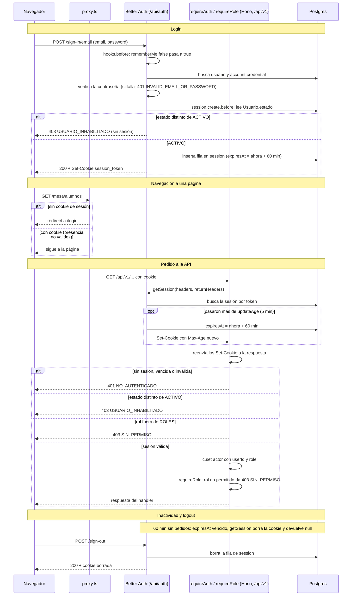

# Arquitectura del backend — Aula Click

Cómo está armada la API y qué reglas sigue cada capa. Las convenciones que se repiten en todas las features (fechas, paginación, búsqueda, auditoría y la especificación de `src/server/shared/`) están en [`convenciones-backend.md`](./convenciones-backend.md). Lo que ve el frontend (URLs, formatos, errores) está en [`contrato-api.md`](./contrato-api.md). Las reglas transversales y las de ESLint, en `AGENTS.md`.

## Stack

- **Next.js 16**: el `app/` sirve las páginas y los Route Handlers que exponen la API.
- **Hono + `@hono/zod-openapi`**: el framework de la API, montado adentro de Next.
- **Prisma 7** (`@prisma/adapter-pg`, driver `pg`): ORM contra Postgres.
- **Better Auth**: autenticación y sesiones, con adaptador de Prisma.
- **Zod 4**: validación de entrada y salida; genera el spec de OpenAPI.
- **MinIO / S3** (`@aws-sdk/client-s3`): almacenamiento de archivos.
- **Docker Compose**: levanta Postgres y MinIO en desarrollo (`pnpm services:up`).
- **Vitest**: tests de services y de `shared/`.

## Cómo arrancan las piezas

1. `docker-compose.yml` levanta Postgres y MinIO.
2. `src/config/env.ts` valida **todas** las variables de entorno con Zod al importarse por primera vez. Si falta o está mal una, tira una excepción con el detalle de qué falta: la app no puede arrancar "a medias".
3. `src/lib/prisma.ts`, `src/lib/auth.ts` y `src/lib/storage.ts` crean las instancias únicas de Prisma Client, Better Auth y el cliente de S3/MinIO, leyendo de `env`.
4. `src/server/app.ts` arma la instancia de Hono (`createRouter().basePath('/api/v1')`), instala `app.onError(errorHandler)` y el `notFound`, registra un router por feature y expone `/api/v1/openapi.json` y Swagger UI en `/api/v1/docs`.
5. Dos adaptadores en `src/app/api/` conectan Hono y Better Auth con Next:
   - `app/api/v1/[[...route]]/route.ts`: `handle(app)` de `hono/vercel`; expone la API de negocio.
   - `app/api/auth/[...all]/route.ts`: `toNextJsHandler(auth)`; expone Better Auth con su propio prefijo (`/api/auth/...`), sin mezclarse con `/api/v1`.

## Estructura

```
src/
├── config/env.ts                     # único lugar que lee process.env; fail-fast con Zod
├── lib/
│   ├── prisma.ts                     # singleton (globalThis) con adaptador pg
│   ├── auth.ts                       # Better Auth
│   ├── auth-reglas.ts                # constantes y reglas de auth sin efectos (testeables)
│   └── storage.ts                    # único punto que conoce MinIO/S3
├── proxy.ts                          # redirección a /login (ver "Autenticación y autorización")
├── server/
│   ├── app.ts                        # basePath('/api/v1'), onError, notFound, OpenAPI y Swagger UI
│   ├── router.ts                     # createRouter() y el tipo AppEnv
│   ├── errors/                       # AppError y subclases, errorHandler, ErrorResponseSchema
│   ├── middlewares/auth.ts           # requireAuth() + requireRole(...)
│   ├── shared/                       # actor, estado, paginacion, zod, busqueda, fechas, auditoria (ver convenciones-backend.md)
│   └── features/<dominio>/
│       ├── <dominio>.routes.ts
│       ├── <dominio>.controller.ts
│       ├── <dominio>.validation.ts
│       ├── <dominio>.service.ts
│       ├── <dominio>.repository.ts
│       ├── <dominio>.ejemplos.ts      # opcional: ejemplos del OpenAPI
│       ├── <regla>.ts                 # opcional: funciones puras de dominio (p. ej. alumnos/edad.ts)
│       └── __tests__/                 # <dominio>.service.test.ts, <dominio>.routes.test.ts, <regla>.test.ts, <dominio>.repository.test.ts (excepcional)
└── generated/prisma/                 # cliente generado: no se edita ni se commitea
```

Features de API del Sprint 1: `alumnos`, `profesores` (incluye materias asignadas y bloques de clase), `materias` y `turnos` (prioridad, capacidad, solapamientos, agenda). La referencia para copiar el patrón es `alumnos`; una feature nueva se crea con `/nueva-feature-api <dominio>` (Claude Code) o copiando `alumnos` a mano.

### Qué es una feature

Una feature agrupa las reglas de **un concepto del negocio**, no de una tabla ni de un rol. El rol dice qué puede hacer alguien (se declara en la ruta con `requireRole(...)`); la feature dice de qué trata la regla.

- **Rol ≠ feature.** `PROFESOR` es un rol de `Usuario`, pero `Profesor` es una entidad propia (1:1 con `Usuario`) con datos y reglas que otros usuarios no tienen: título, matrícula, materias asignadas y bloques de clase. Por eso vive en `profesores` y no en una feature `usuarios`. Sus URLs usan `Profesor.id` (`/profesores/{id}/materias`), no `Usuario.id`.
- **Todo lo del concepto va en su feature, aunque toque otras tablas.** El alta de un profesor escribe `Usuario`, `Account` y `Profesor`, y su baja cambia `Usuario.estado`: las dos son reglas de profesores y van en `profesores`. Lo mismo las asignaciones (`AsignacionMateria`), que son del profesor aunque tengan su propia tabla.
- **`Usuario`, `Session` y `Account` son infraestructura de autenticación**: los maneja Better Auth (`src/lib/auth.ts`) y no forman una feature por sí solos.
- **Una feature `usuarios` solo se crea para lo que vale para cualquier usuario sin importar su rol** (cambiar la contraseña propia, que un gerente habilite o inhabilite cuentas, listar todos los usuarios). Convive con `profesores`, no la reemplaza.
- **Criterio para una feature nueva:** tiene datos o reglas propias que el resto no tiene. Un rol nuevo que solo cambia permisos no es una feature: es un valor más en `requireRole(...)`.

## Capas de una feature

| Capa       | Hace                                                                                                                                                                                                                                                  | No hace                                                   |
| ---------- | ----------------------------------------------------------------------------------------------------------------------------------------------------------------------------------------------------------------------------------------------------- | --------------------------------------------------------- |
| routes     | Contrato HTTP: path, método, schemas, status codes y middlewares de auth. Cada endpoint se declara con `createRoute()` y es la fuente del OpenAPI                                                                                                     | Lógica                                                    |
| controller | Recibe el dato ya validado, obtiene el `Actor` con `c.get('actor')`, llama al service y arma la respuesta (200, 201, 204…)                                                                                                                            | Acceder a la base, aplicar reglas de negocio, `try/catch` |
| validation | Schemas Zod de entrada, salida y params                                                                                                                                                                                                               | Reglas de negocio                                         |
| service    | Reglas de negocio y de dominio. Lanza `AppError` o sus subclases                                                                                                                                                                                      | Conocer HTTP (Hono, `Context`, status codes) ni Prisma    |
| repository | Operaciones con Prisma; traduce errores del motor (`P2002` → `ConflictError`); completa la auditoría con el `Actor`; devuelve DTOs (tipos de `<dominio>.validation.ts`, fechas ya convertidas, auditoría con `armarAuditoria`), nunca tipos de Prisma | Reglas de negocio                                         |

Flujo: cliente → routes (valida con Zod) → controller → service → repository → Postgres. Cualquier error lanzado lo captura `app.onError`.

**Criterio:** si un service solo reenvía una llamada al repository en un caso trivial, es aceptable. Lo que no se negocia es que solo el repository toque Prisma.

## Router y registro de features

- **Toda feature crea su router con `createRouter()` de `src/server/router.ts`, nunca con `new OpenAPIHono()`.** `createRouter()` instala un `defaultHook` que convierte un dato inválido en `ValidationError` (400, con las issues de Zod en `details`), así llega a `app.onError` con el mismo formato que cualquier otro error. Con `new OpenAPIHono()` directo, Hono respondería su propio 400 con otro formato.
- `<dominio>.routes.ts` exporta `<dominio>Routes = createRouter()` y le agrega los endpoints declarados con `createRoute()`.
- `createRouter()` devuelve `OpenAPIHono<AppEnv>`: en los handlers, `c.get('user')`, `c.get('session')` y `c.get('actor')` están tipados (los setea `requireAuth()`).
- Cada feature se registra en `src/server/app.ts` con **una sola línea**: `app.route('/<dominio>', <dominio>Routes)`.

## Dependencias entre features

Una feature solo puede importar el **repository** de otra, y solo para lecturas; nunca su service, controller ni routes. Ejemplo: si `turnos` necesita confirmar que un alumno existe, lee `alumnos.repository.ts`, pero no usa las reglas de `alumnos.service.ts`.

Un repository importa Prisma, `@/server/errors` y `@/server/shared/*`; no importa otros repositories ni services. Así el grafo no tiene ciclos (turnos ↔ profesores ↔ materias) y las reglas de negocio de una feature no quedan acopladas a las de otra. ESLint hace cumplir la parte de imports entre features.

Dentro de una misma feature, los imports son relativos (`./alumnos.repository`, o `../alumnos.service` desde `__tests__`). Con alias (`@/server/features/alumnos/...`), ESLint no distingue la propia feature de otra y lo marca como error.

## Errores

Jerarquía en `src/server/errors/`; todas las clases heredan de `AppError(message, statusCode = 500, { code?, details?, cause? })`. La tabla de clases, status y códigos es parte del contrato con el frontend y está en [`contrato-api.md` → Errores](./contrato-api.md#errores).

- Los services lanzan las clases importadas de `@/server/errors`: `throw new ConflictError('DNI ya registrado')`. Para un código específico: `new ConflictError('...', { code: 'BLOQUE_LLENO', details: fechas })`.
- `errorHandler` (`src/server/errors/error-handler.ts`, instalado con `app.onError`) serializa todo `AppError` con el formato `{ "error": { "code", "message", "details"? } }`.
- Un error no controlado (ni `AppError` ni `HTTPException` de Hono) se registra con `console.error` y responde 500 genérico, sin exponer detalles internos.
- Los fallos de validación de Zod los convierte el `defaultHook` de `createRouter()`: no se lanzan a mano en el controller.
- Las rutas inexistentes de `/api/v1` responden 404 con el mismo formato.
- En `createRoute()`, las respuestas 400/401/403/404/409 se declaran con `ErrorResponseSchema` (`src/server/errors/error-response.ts`).
- No hay `try/catch` en los controllers.

## Validación y OpenAPI

- Todo dato de entrada (params, query, body) se valida con Zod en la ruta.
- Los schemas viven en `<dominio>.validation.ts` y usan el `z` de `@hono/zod-openapi`, para poder llamar a `.openapi({ description, example })`.
- Los tipos se derivan de los schemas; no se duplican a mano.
- Cada endpoint declara todos sus status codes: 200/201/204 según corresponda; 400 si valida entrada; 401 y 403 si usa `requireAuth()`/`requireRole()`; 404 si busca por id; 409 si puede haber conflicto.
- Swagger UI queda en `/api/v1/docs` y el JSON en `/api/v1/openapi.json`. Si los ejemplos ensucian el archivo de rutas, se mueven a `<dominio>.ejemplos.ts`, tipados con `satisfies` contra los tipos de la validation. Se usan desde las rutas (`example` / `examples` del `content`), no desde `.openapi()` de los schemas: si la validation importa los ejemplos y los ejemplos sus tipos, TypeScript no puede inferir el tipo (referencia circular).
- Un campo armado con `.pipe()` (como `dni`, `email` o un opcional que convierte `""` en `null`) aparece en el OpenAPI solo como `string`: se le agrega con `.openapi({ description, example, enum, maxLength })` lo que se pierde, aplicado **antes** de `.nullable()` (si se declara `type` a mano, el generador deja de marcarlo `nullable`).

## Autenticación y autorización

`src/lib/auth.ts` configura Better Auth con `emailAndPassword` sobre el modelo de dominio `Usuario`:

```ts
user: {
  modelName: 'usuario', // delegate de Prisma (prisma.usuario)
  fields: { name: 'nombre' },
  additionalFields: {
    role: { type: [...ROLES], required: true, input: false }, // Session['user']['role'] es Role
    // apellido, dni, busqueda, telefono y estado: { type: 'string', required: true, input: false }
  },
},
```

Las constantes y reglas que no necesitan la instancia de Better Auth viven en **`src/lib/auth-reglas.ts`**, que no importa `env`, Prisma ni `auth.ts` (así se testean sin base ni variables de entorno): tiempos de sesión, largos de contraseña, el código y el mensaje de usuario inhabilitado, `crearGuardaSesion()` y `forzarRecordarSesion()`.

- `Session`, `Account` y `Verification` conservan los nombres de modelo y de campo de Better Auth (son infraestructura); sus tablas y columnas se mapean a snake_case. `Usuario` no tiene contraseña: vive en `Account.password`, con `providerId: 'credential'` y `accountId` = id del usuario.
- `input: false` impide que alguien se asigne un rol o un dato de dominio al registrarse; con `required: true`, un alta por la API pública responde 400 en lugar de fallar en la base. No hay `defaultValue` de rol: la cuenta se crea con su rol explícito.
- `Usuario.role` es un FK de texto al catálogo `Rol` (`MESA_ENTRADAS`, `PROFESOR`, `GERENTE`, `ALUMNO`; decisión T-17), así la base rechaza valores inválidos. La fuente en código es `ROLES` de `src/server/shared/actor.ts`.
- **Alta de cuentas:** no se usa `auth.api.signUpEmail` (queda bloqueado con `disableSignUp`). Se escriben `Usuario` y su `Account` credential, con la contraseña hasheada por `hashPassword()` de `src/lib/auth.ts`, que usa el mismo hasher con el que Better Auth verifica el login (`(await auth.$context).password.hash`). Así lo hacen el seed y el alta de profesor (decisiones T-21 y T-22).
- **Registro público cerrado:** `emailAndPassword.disableSignUp: true`. `POST /api/auth/sign-up/email` responde 400 `EMAIL_PASSWORD_SIGN_UP_DISABLED` (detalle en `convenciones-backend.md` → Seguridad de cuentas).
- **Contraseña:** `minPasswordLength` / `maxPasswordLength` se configuran explícitos con `LARGO_MINIMO_PASSWORD` (8) y `LARGO_MAXIMO_PASSWORD` (128), los defaults de Better Auth. Quien crea una cuenta desde el servidor valida con esas mismas constantes.
- **Credenciales incorrectas:** Better Auth (`signInEmail`) responde siempre 401 `INVALID_EMAIL_OR_PASSWORD`, sea que el email no exista, que la cuenta no tenga contraseña o que la contraseña no coincida; cuando el usuario no existe igual hashea, para igualar tiempos. No se reimplementa. Un email con formato inválido da 400 `INVALID_EMAIL`, que no revela si la cuenta existe.

### Sesión por inactividad

- `session.expiresIn = SESION_INACTIVIDAD_SEGUNDOS` (60 min, decisión T-24) y `session.updateAge = SESION_RENOVACION_SEGUNDOS` (5 min). Cada pedido que valida la sesión (`getSession`) la renueva si pasaron más de `updateAge` desde la última renovación: `expiresAt = ahora + 60 min` en la base y la cookie se reemite con `Max-Age` nuevo. Sin uso, vence entre 55 y 60 minutos después del último pedido. Cada renovación es una escritura en `session`: `updateAge` equilibra ese costo contra la precisión del vencimiento.
- **`requireAuth()` reenvía los `Set-Cookie`** que devuelve `getSession` (lo llama con `returnHeaders: true`), también cuando responde 401 o 403. Sin eso, la renovación extendería la sesión en la base pero la cookie del navegador vencería a los 60 min del login, y el vencimiento pasaría a ser absoluto.
- **`rememberMe` se ignora.** Con `rememberMe: false`, Better Auth fija la sesión en 1 día y deja una cookie `dont_remember` que desactiva la renovación. Un `hooks.before` sobre `/sign-in/email` (`forzarRecordarSesion()`) lo cambia a `true` del lado del servidor.
- Sin `cookieCache`: con caché, un usuario dado de baja seguiría pasando hasta que venciera.

### Usuario inactivo

- **En el login:** `databaseHooks.session.create.before` corre `crearGuardaSesion()`, que lee `Usuario.estado` con Prisma y, si no es `ACTIVO` (o el usuario no existe), lanza 403 `USUARIO_INHABILITADO` ("Su usuario no está habilitado") y la sesión no se crea. Va ahí porque `signInEmail` crea la sesión **después** de verificar la contraseña: con una contraseña incorrecta, el usuario inactivo recibe el mismo 401 que cualquiera y no se filtra que el email existe.
- **Con la sesión abierta:** `requireAuth()` vuelve a mirar `user.estado` en cada pedido a `/api/v1` (defensa en profundidad).
- Vale para cualquier `Usuario` (la baja del profesor es la de su usuario, T-22).
- Dar de baja a un usuario **debe revocar sus sesiones** (tabla `session`); lo hace la tarea que implementa la baja.

### Proxy y middlewares

Hay dos chequeos separados:

- **`src/proxy.ts`** solo redirige a `/login` si no hay cookie de sesión (`getSessionCookie`, que verifica presencia, no validez). Nunca decide roles ni agrega parámetros a la redirección. Es código que puede correr separado de la app: no importa módulos del proyecto.
  - Protege **todas** las rutas salvo `/login`, `/api/*`, los internos de Next (`/_next/static`, `/_next/image`) y los archivos estáticos (toda ruta con un punto, como `/favicon.ico`), con un `matcher` negativo, para que una sección nueva quede protegida sin tocar el proxy: `'/((?!login(?:/|$)|api(?:/|$)|_next/static|_next/image|.*\\..*).*)'`. `login` y `api` van delimitados para no excluir `/loginx`. Consecuencia del criterio de estáticos: una página con un punto en la URL no pasa por el proxy (la API igual exige sesión).
- **`src/server/middlewares/auth.ts`**:
  - `requireAuth()` llama a `getSession`, reenvía los `Set-Cookie` y chequea en orden: sin sesión → 401 `NO_AUTENTICADO`; `estado` distinto de `ACTIVO` → 403 `USUARIO_INHABILITADO`; rol que no pasa `esRole` (null, vacío o fuera de `ROLES`) → 403 `SIN_PERMISO`. Si todo pasa, deja `user`, `session` y `actor` (`{ userId, role }`) en el contexto.
  - `requireRole(...roles: [Role, ...Role[]])` va después de `requireAuth()`: exige al menos un rol y solo valores de `ROLES` (un rol mal escrito no compila) y lanza 403 `SIN_PERMISO` si el rol del `Actor` no está en la lista. Usado sin `requireAuth()` antes es un error de programación: se registra en consola y responde 500 genérico.
  - Cada endpoint privado declara su rol.

### Flujo



- La guarda de estado corre **después** de verificar la contraseña: así un usuario inactivo con contraseña incorrecta ve el mismo 401 que cualquiera, y solo quien conoce la contraseña se entera de que está inhabilitado.
- La renovación la hace Better Auth dentro de `getSession`, pero la cookie nueva viaja en la respuesta de `/api/v1`: por eso `requireAuth()` reenvía los `Set-Cookie`. En `/api/auth/get-session` los devuelve Better Auth solo.
- El proxy no valida la sesión: una cookie vencida pasa el proxy y el primer pedido a `/api/v1` responde 401, que la UI maneja (T-04).

### Qué responde cada falla

`/api/auth/*` responde con el formato de Better Auth, `{ "code", "message" }` (el `authClient` lo expone como `error.code` / `error.message`, con `message` en inglés). `/api/v1/*` responde con `{ "error": { "code", "message" } }`. Los códigos son los de [`contrato-api.md`](./contrato-api.md#errores) → Errores y Autenticación.

| Situación                                                 | Dónde se decide                                 | Status | `code`                            | Formato del cuerpo             | Qué hace la UI (T-04)                      |
| --------------------------------------------------------- | ----------------------------------------------- | ------ | --------------------------------- | ------------------------------ | ------------------------------------------ |
| Credenciales incorrectas (email inexistente o clave mala) | Better Auth, `signInEmail`                      | 401    | `INVALID_EMAIL_OR_PASSWORD`       | Better Auth                    | "Usuario o contraseña incorrectos"         |
| Usuario inactivo en el login (clave correcta)             | `session.create.before` → `crearGuardaSesion()` | 403    | `USUARIO_INHABILITADO`            | Better Auth                    | "Su usuario no está habilitado"            |
| Usuario inactivo con sesión abierta                       | `requireAuth()`                                 | 403    | `USUARIO_INHABILITADO`            | `{ error: { code, message } }` | Mensaje del 403 y cierre de sesión         |
| Registro público                                          | Better Auth, `disableSignUp`                    | 400    | `EMAIL_PASSWORD_SIGN_UP_DISABLED` | Better Auth                    | No hay pantalla de registro                |
| Sin cookie en una página                                  | `proxy.ts`                                      | 307    | —                                 | Redirección a `/login`         | Muestra el login                           |
| Sesión vencida o inválida en `/api/v1`                    | `requireAuth()`                                 | 401    | `NO_AUTENTICADO`                  | `{ error: { code, message } }` | Redirige a `/login` con "Tu sesión expiró" |
| Usuario sin rol o con rol inválido                        | `requireAuth()` (`esRole`)                      | 403    | `SIN_PERMISO`                     | `{ error: { code, message } }` | Mensaje de sin permiso                     |
| Rol no permitido para el endpoint                         | `requireRole(...)`                              | 403    | `SIN_PERMISO`                     | `{ error: { code, message } }` | Mensaje de sin permiso                     |
| `requireRole` usado sin `requireAuth` (error de código)   | `requireRole` → `errorHandler`                  | 500    | `ERROR_INTERNO`                   | `{ error: { code, message } }` | Error genérico                             |

### Cambios frecuentes

- **Proteger un endpoint nuevo:** en `createRoute()`, `middleware: [requireAuth(), requireRole('MESA_ENTRADAS')] as const` (el `as const` hace que Hono infiera el contexto), y declarar las respuestas 401 y 403 con `ErrorResponseSchema`. En el controller, `c.get('actor')` se le pasa al service. Ejemplo que compila en `server/middlewares/__tests__/auth.test.ts` → "uso en createRoute()".

  ```ts
  const listarRoute = createRoute({
    method: 'get',
    path: '/',
    middleware: [requireAuth(), requireRole('MESA_ENTRADAS')] as const,
    responses: {
      200: { content: { 'application/json': { schema: ListadoSchema } }, description: 'Listado' },
      401: {
        content: { 'application/json': { schema: ErrorResponseSchema } },
        description: 'Sin sesión',
      },
      403: {
        content: { 'application/json': { schema: ErrorResponseSchema } },
        description: 'Sin permiso',
      },
    },
  })
  ```

- **Agregar o renombrar un rol:** en el mismo PR, el catálogo `rol` del seed, `ROLES` en `src/server/shared/actor.ts`, el tipo `Role` de `src/types/index.ts` y `contrato-api.md` → Roles.
- **Crear una cuenta desde el servidor:** `Usuario` + `Account` (`providerId: 'credential'`, `accountId` = id del usuario) con `hashPassword()`, validando el largo con `LARGO_MINIMO_PASSWORD` / `LARGO_MAXIMO_PASSWORD`. Nunca `auth.api.signUpEmail` (bloqueado por `disableSignUp`) ni un hash a mano. Referencia: `prisma/seed.ts`. Al dar de baja un usuario, revocar sus sesiones.

## Configuración

- `src/config/env.ts` es el único archivo que lee `process.env` (excepción: `prisma7.config.ts`, que corre fuera de Next y carga `.env` con `dotenv`).
- Variable nueva = se agrega al schema de `env.ts` y a `.env.example`; los dos deben tener exactamente las mismas variables (`NODE_ENV` queda fuera del `.env`: tiene default y lo fija Next).
- `env` se importa solo desde `src/lib/` y `src/config/` (y desde `prisma/seed.ts`, que lee de ahí las variables `SEED_*`, opcionales para la app). Las features no dependen de la configuración; por eso sus tests no necesitan variables de entorno y el CI no las define.

## Prisma

El cliente se instancia una sola vez en `src/lib/prisma.ts`, con el patrón `globalThis` (para que el hot reload no abra pools nuevos) y el adaptador `@prisma/adapter-pg`. Se importa `prisma` de ahí, solo desde repositories (y desde `src/lib/auth.ts`). Nunca `new PrismaClient()` en otro archivo.

- **Seed** (`prisma/seed.ts`): la otra excepción. Usa Prisma directo, `env` e `hashPassword()` de `src/lib/auth.ts`, y `normalizarBusqueda()` de `src/server/shared/`. Está fuera de `src/`, así que las reglas de ESLint por zona no lo alcanzan. Es idempotente (todo `upsert` por clave natural) y se corre con `pnpm db:seed`: en Prisma 7, `migrate dev` ya no lo ejecuta solo. Está registrado en `prisma7.config.ts` (`migrations.seed`).
- **Restricciones `CHECK`** (`bloque_agenda`: día, horas y capacidad; `turno`: orden de fechas y sesión única; `profesor`: capacidad >= 1): Prisma no las genera, así que se agregan a mano al `migration.sql` de la migración que crea esas tablas.
- Tablas y columnas en snake_case (`@@map` / `@map`); modelos en PascalCase y campos en camelCase.
- **Errores del motor con Prisma 7 + `@prisma/adapter-pg`** (verificado en el runtime 7.10): se importa `Prisma` de `@/generated/prisma/client` y se compara con `error instanceof Prisma.PrismaClientKnownRequestError` y `error.code`. En un `P2002`, `meta` no trae `target` (eso era del engine clásico): trae `{ modelName, driverAdapterError }`, y la restricción está en `meta.driverAdapterError.cause.constraint`, como `{ index: '<tabla>_<campo>_key' }` (el nombre del índice único; `pg` lo informa siempre) o `{ fields: [...] }` si no hay nombre. Si la tabla tiene un solo `UNIQUE` y la forma no se puede leer, se asume ese campo. `P2025` (registro inexistente en un `update`) se traduce a `NotFoundError`. Ejemplo en `alumnos.repository`.

## Archivos

- Solo `src/lib/storage.ts` conoce MinIO/S3 (`putObject`, `deleteObject`, `getPresignedUrl`).
- En la base se guarda la **clave** del objeto, no la URL.
- Para mostrar un archivo se genera una URL prefirmada de lectura, con TTL por defecto de 900 s (15 min), para que no venza mientras el usuario está en pantalla.
- La foto del profesor (JPG/PNG, chica) sube por **multipart a la API**. El navegador no sube directo a MinIO.

## Tests

- Vitest, un archivo por service dentro de su feature: `server/features/<dominio>/__tests__/<dominio>.service.test.ts`. Se ejecutan con `pnpm test:run` (`pnpm test` es modo watch).
- El repository se reemplaza por un mock: sin Docker ni Postgres. Los tests no importan `@/config/env`.
- **Patrón del service:** `<dominio>.service.ts` exporta una fábrica `crear<Dominio>Service({ repository, reloj })` (`reloj` opcional; por defecto el del sistema, vía `hoy(reloj)`) y `<dominio>.controller.ts` arma la única instancia: `crear<Dominio>Service({ repository: <dominio>Repository })`. El service importa el repository **solo como tipo** (`import type`), así no carga Prisma ni `@/config/env`. El test crea el service con un repository falso (un objeto de `vi.fn<Repository['metodo']>()`) y un reloj fijo, sin `vi.mock` del repository.
- Opcional: `<dominio>.routes.test.ts` prueba el contrato HTTP (validación de Zod, 401/403, que el OpenAPI declare todos los status codes) con el repository y `@/lib/auth` mockeados. Referencia: `alumnos/__tests__/`.
- Casos mínimos: el camino feliz + uno por cada error que el service puede lanzar (uno por cada 4xx que declara su ruta). Un `it.todo` no cuenta como cobertura.
- Las funciones puras (por ejemplo `prioridad.ts` en `turnos`) se testean directo.
- Excepcional: `<dominio>.repository.test.ts`, solo cuando una **condición de consulta** es una regla del dominio que otras features reutilizan y hay que fijarla con casos (la de turno vigente: `turnos/__tests__/turnos.repository.test.ts`). Mockea `@/lib/prisma` con `vi.hoisted` y verifica el `where` que recibe Prisma; no usa base. No reemplaza al test del service: las reglas se siguen probando ahí.
- Tests del middleware de auth (`server/middlewares/__tests__/auth.test.ts`): `vi.mock('@/lib/auth')` con `vi.hoisted`, sin base ni variables de entorno.
- Las reglas de auth (`src/lib/__tests__/auth-reglas.test.ts`) se testean directo: `auth-reglas.ts` no importa `env` ni Prisma.
- El `matcher` de `src/proxy.ts` se prueba en `src/__tests__/proxy.test.ts` con `unstable_doesMiddlewareMatch` de `next/experimental/testing/server` (en Next 16.3.5 se llama así, aunque la guía nombre `unstable_doesProxyMatch`).
- `src/server/shared/` tiene sus propios tests en `shared/__tests__/` (ver `convenciones-backend.md`).
